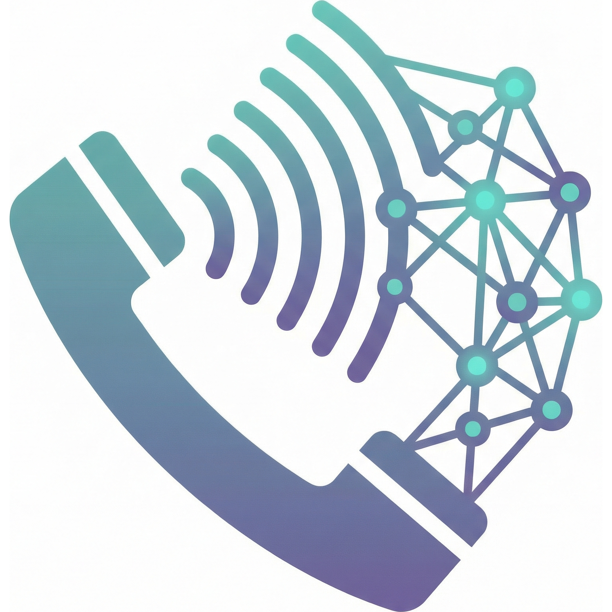

[](https://github.com/frederikb96/twilio-voice-bridge/actions/workflows/ci.yaml)
[](https://github.com/frederikb96/twilio-voice-bridge/releases)
[](https://opensource.org/licenses/MIT)

<table>
<tr>
<td width="140">

</td>
<td>
<h1>twilio-voice-bridge</h1>
Modular Twilio Voice to AI bridge. Connect phone calls to OpenAI, Gemini, or any voice provider via WebSocket.
</td>
</tr>
</table>

> **Note:** This repo is provided as a reference implementation. I'm not actively maintaining it -- feel free to fork it and build your own thing on top.

## What Is This?

A lightweight server that sits between Twilio and any AI voice provider. When someone calls your Twilio phone number, the server accepts the call, opens a bidirectional audio stream via WebSocket, and bridges it to an AI provider. The caller talks to the AI naturally over a regular phone call.

OpenAI's Realtime API is included as the reference provider implementation. The architecture is designed around a simple `AudioProvider` protocol -- swap in Google Gemini, a local Whisper + Ollama stack, or anything else that can send and receive audio over WebSocket.

This project started as a workaround for the Garmin Fenix 8's lack of microphone API access. The watch can make phone calls, but Garmin's SDK doesn't expose the microphone for third-party apps. By routing calls through Twilio to a server, any watch or phone becomes a voice interface to AI -- press a button, make a call, and start talking to your assistant. More context on this in the [Garmin developer forums](https://forums.garmin.com/).

## Architecture

```
    Phone / Watch              Twilio                Server               AI Provider
    =============          ==========          ===============         =============
         |                      |                      |                      |
         |--- phone call ------>|                      |                      |
         |                      |--- POST /incoming -->|                      |
         |                      |<-- TwiML <Stream> ---|                      |
         |                      |                      |                      |
         |<======= Twilio WebSocket =======>|<==== Provider WebSocket =====>  |
         |                      |                      |                      |
         |   g711_ulaw audio ---|----> send_audio() -->|--- audio chunks ---> |
         |                      |                      |                      |
         |                      |<--- AudioDelta ------|<-- AI response ----- |
         |<-- audio playback ---|                      |                      |
         |                      |                      |                      |
         |                      |<--- SpeechStarted ---|  (interrupt: clear)  |
         |                      |                      |                      |
         |--- hang up --------> |--- stop ------------>|--- disconnect() ---->|
```

The server runs two concurrent async tasks per call: one relays audio from Twilio to the provider, the other streams AI responses back. When the provider detects the caller started speaking (VAD), a `clear` event interrupts any in-progress AI playback.

## Setup Guide

You'll need: Python 3.12+, [ngrok](https://ngrok.com/) (free tier works), a Twilio account, and an OpenAI API key.

### Step 1: Twilio -- get a phone number

- Create a Twilio account at [twilio.com/try-twilio](https://www.twilio.com/try-twilio). The free trial includes a phone number and some credit.
- Go to *Phone Numbers* -> *Buy a Number*. Pick one with **Voice** capability. The free trial number may be US-only (not 100% sure). If you're in Europe, I ended up buying a Netherlands number -- as far as I could tell, it was one of the few EU countries where Twilio lets individuals buy a number without business registration. A local number also avoids international calling fees for callers.
- From the Twilio Console dashboard, copy your **Auth Token** -- you'll need it in Step 3.

**Optional: regional routing for non-US servers.** By default, Twilio routes all calls through the US region, even for non-US phone numbers. If your server is in Europe, switch inbound processing to Ireland for lower latency: select your number -> *Routing* section -> click *Re-route* -> switch to Ireland (ie1). See [Twilio's inbound processing region docs](https://www.twilio.com/docs/global-infrastructure/inbound-processing-console) for details.

### Step 2: OpenAI -- get an API key

- Go to [platform.openai.com/api-keys](https://platform.openai.com/api-keys) and create an API key.
- Make sure your account has access to the **Realtime API** (it's included by default on paid plans).

### Step 3: Install and configure

```bash
git clone https://github.com/frederikb96/twilio-voice-bridge.git
cd twilio-voice-bridge
python3 -m venv .venv && source .venv/bin/activate
pip install -r requirements.txt
cp .env.example .env
```

Edit `.env` and fill in the two required values:
```
TWILIO_AUTH_TOKEN=paste_your_twilio_auth_token
OPENAI_API_KEY=paste_your_openai_api_key
```

Everything else has sensible defaults. See [Configuration](#configuration) for the full list.

### Step 4: Start the server and ngrok

Open two terminals:

```bash
# Terminal 1: start the server
cd twilio-voice-bridge
source .venv/bin/activate
uvicorn src.server:app --host 0.0.0.0 --port 5050
```

```bash
# Terminal 2: expose via ngrok
ngrok http 5050
```

ngrok will show a forwarding URL like `https://abc123.ngrok-free.app`. Copy it -- you need it for the next step.

### Step 5: Connect Twilio to your server

Go back to the Twilio Console and configure the webhook for your phone number.

**Important if you changed the region in Step 1:** Phone number configurations in Twilio are **per region**. Make sure the console URL in your browser includes your region:
```
https://console.twilio.com/ie1/develop/...
```
If it says `us1` instead of `ie1`, you're editing the wrong region's config and calls won't reach your server.

Navigate to *Phone Numbers* -> *Manage* -> *Active Numbers* -> select your number -> under *Voice Configuration*:
- Set "A call comes in" to **Webhook** (not TwiML App)
- Method: **POST**
- URL: your ngrok URL + `/incoming-call`:
  ```
  https://abc123.ngrok-free.app/incoming-call
  ```

### Step 6: Test it

Call your Twilio phone number. The AI should greet you within a few seconds. Talk to it -- you're having a voice conversation with the AI over a regular phone call.

If something goes wrong, check the [Troubleshooting](#troubleshooting) section.

## Production Deployment

Once everything works via ngrok, you can move to a real deployment.

### Docker

```bash
docker compose up --build
```

### Going live

For production, put this behind a reverse proxy (nginx, Caddy, Traefik) that terminates TLS. Twilio requires HTTPS for webhooks and WSS for media streams.

- Point a domain at your server
- Set up TLS (Let's Encrypt / Caddy does this automatically)
- Update the Twilio webhook URL from your ngrok URL to `https://your-domain.com/incoming-call`
- Consider setting `ALLOWED_CALLERS` to restrict who can use your bridge

## Security

Your webhook is protected by **Twilio signature validation**. Every request Twilio sends to `/incoming-call` is cryptographically signed using your `TWILIO_AUTH_TOKEN`. The server recomputes the signature and rejects anything that doesn't match. This means:

- Another Twilio user can't point their number at your server -- their requests are signed with a different token, so they'll get a 403.
- A random HTTP client can't hit your webhook either -- no valid signature, no entry.

On top of that, `ALLOWED_CALLERS` lets you restrict which phone numbers are allowed through, even from valid Twilio requests. Note that caller ID can be spoofed via VoIP, so for sensitive deployments consider adding a voice PIN prompt before connecting to the AI.

## How I Use This

I built this to turn my Garmin Fenix 8 smartwatch into a voice AI interface. The watch has a speaker and microphone for phone calls, but Garmin's Connect IQ SDK doesn't expose the mic to third-party apps. So instead of fighting the SDK, I went around it: the watch dials a Twilio number, which routes to this server, which connects to OpenAI's Realtime API. You can set up the phone number as a contact and then access it via the watch's built-in phone app to dial it as long as the watch is connected to my phone to route the call. Voice will be via the watch's speaker and mic.

From button press to hearing "Hello" takes about 5 seconds. The call quality is standard phone audio (8kHz) which works well for voice conversations.

My private fork extends this with Home Assistant integration (lights, climate, sensors), task scheduling, calendar access, and web research -- but that's all custom function calling layered on top of this same bridge architecture.

## Configuration

All settings are loaded from environment variables (or a `.env` file). See `.env.example` for a ready-to-use template.

| Variable | Required | Default | Description |
|----------|----------|---------|-------------|
| `TWILIO_AUTH_TOKEN` | **Yes** | -- | Auth token from Twilio Console, used to validate webhook signatures |
| `OPENAI_API_KEY` | **Yes** (when using OpenAI provider) | -- | OpenAI API key with Realtime API access |
| `PROVIDER` | No | `openai` | Which AI provider to use |
| `SYSTEM_PROMPT` | No | `You are a helpful voice assistant.` | Instructions for the AI assistant |
| `INITIAL_PROMPT` | No | `Greet with a very quick and short Hello.` | Injected as a user message on connect so the AI speaks first |
| `VOICE` | No | `alloy` | Voice for the AI assistant (provider-specific) |
| `MODEL` | No | `gpt-4o-realtime-preview` | Model to use (provider-specific) |
| `TEMPERATURE` | No | `0.8` | Response temperature (0.0 = deterministic, 1.0 = creative) |
| `VAD_TYPE` | No | `semantic_vad` | Voice activity detection: `semantic_vad` (smarter) or `server_vad` (legacy) |
| `VAD_EAGERNESS` | No | *(OpenAI default)* | Eagerness for semantic_vad: `low`, `medium`, `high`, or `auto` |
| `ALLOW_INTERRUPT` | No | `true` | Allow user to interrupt (barge-in) while assistant speaks |
| `ALLOWED_CALLERS` | No | *(empty = allow all)* | Comma-separated phone numbers in E.164 format (e.g. `+14155551234,+49151...`) |
| `MAX_CALL_DURATION` | No | `300` | Maximum call duration in seconds (cost protection) |
| `PORT` | No | `5050` | Server port |
| `LOG_LEVEL` | No | `INFO` | Logging level |

## Creating a Custom Provider

The entire bridge is provider-agnostic. To add a new AI backend, implement the `AudioProvider` protocol:

```python
from collections.abc import AsyncIterator

from src.provider import (
    AudioDelta,
    AudioDone,
    AudioEvent,
    ProviderConfig,
    SpeechStarted,
    SpeechStopped,
)


class MyProvider:
    """AudioProvider implementation for My AI Service."""

    async def connect(self, config: ProviderConfig) -> None:
        """Establish connection to the provider.

        Use config.extra for provider-specific settings (API keys, etc).
        """
        ...

    async def send_audio(self, audio_payload: str) -> None:
        """Forward base64-encoded g711_ulaw audio from the caller."""
        ...

    async def receive_audio(self) -> AsyncIterator[AudioEvent]:
        """Yield audio events back to the caller.

        AudioDelta(payload=...)  -- chunk of base64 audio to play
        AudioDone()              -- response finished
        SpeechStarted()          -- caller started speaking (interrupts playback)
        SpeechStopped()          -- caller stopped speaking
        """
        ...

    async def disconnect(self) -> None:
        """Clean up connections."""
        ...
```

Then register it in `src/providers/__init__.py`:

```python
from .my_provider import MyProvider

PROVIDERS: dict[str, type[Any]] = {
    "openai": OpenAIRealtimeProvider,
    "my_provider": MyProvider,
}
```

Set `PROVIDER=my_provider` in your `.env` and you're done. The bridge handles all Twilio communication -- your provider only needs to speak audio.

**Audio format:** Twilio Media Streams sends g711_ulaw at 8kHz mono. If your AI backend uses a different format, convert in your provider's `send_audio()` / `receive_audio()` methods. OpenAI's Realtime API accepts g711_ulaw natively, so the included provider needs no conversion.

**Ideas:** Google Gemini provider, local Whisper + Ollama for fully offline operation, Amazon Nova Sonic, ElevenLabs, or a simple echo provider for testing.

## Cost

The main cost components are: Twilio (phone number rental + per-minute voice charges), the AI provider (OpenAI Realtime API charges per minute of audio), and server hosting. The AI provider dominates the cost by far. Using a smaller model like `gpt-4o-mini-realtime-preview` significantly reduces this. The `MAX_CALL_DURATION` setting acts as a cost safety net.

## Known Limitations

- **Latency ~950-1100ms** -- The phone call infrastructure (PSTN + Twilio Media Streams) adds ~200-300ms before the AI even starts processing. Total mouth-to-ear time is roughly 1 second. Functional, but noticeably slower than talking to Siri or Alexa.
- **Single concurrent call per instance** -- The architecture assumes one active call. A second call will get its own bridge session, but scaling to many concurrent calls would need separate provider connections and resource management.
- **8kHz phone audio** -- Twilio Media Streams uses g711_ulaw at 8kHz mono. Adequate for speech, but not HD audio. This is inherent to the PSTN path.
- **No WebSocket reconnection** -- If the provider connection drops mid-call (network blip, API timeout), the call dies. No automatic retry.
- **Caller ID is spoofable** -- The `ALLOWED_CALLERS` filter checks the `From` field, which can be spoofed via VoIP services. For sensitive deployments, consider adding a voice PIN prompt before connecting to the AI.

## Legal Notice

While this system does not record calls, it processes and transmits audio content to third-party AI services in real time. This may fall under recording/monitoring regulations depending on your jurisdiction and use case. I am only using it for my private calls and limit it to my own phone number.

## Troubleshooting

- **Call connects but no audio** -- Verify your Twilio webhook URL ends with `/incoming-call`. Check that the WebSocket connection upgrades to `wss://` (not `ws://`). If using ngrok, make sure it's still running.

- **403 on incoming call** -- The server validates Twilio webhook signatures. Ensure `TWILIO_AUTH_TOKEN` in `.env` matches your Twilio Console. Also check that the webhook URL configured in Twilio matches exactly what your server sees (watch for trailing slashes, HTTP vs HTTPS). If you changed the Twilio region, make sure you configured the webhook in the correct region's console (check for `ie1` vs `us1` in the URL).

- **OpenAI connection fails** -- Verify your API key is valid. Check that the model name is correct (`gpt-4o-realtime-preview`). Look at server logs for the specific error.

- **Audio is choppy or delayed** -- Server location matters. Deploy close to your Twilio region for lower latency. Check server CPU/memory -- audio relay is lightweight but network I/O matters.

- **Call drops after a few minutes** -- Check `MAX_CALL_DURATION` (default: 300 seconds / 5 minutes). Increase it in `.env` if needed.

- **"Unknown provider" error at startup** -- The `PROVIDER` value in `.env` must match a key in `src/providers/__init__.py`. Currently only `openai` is included.

## License

[MIT](LICENSE)
